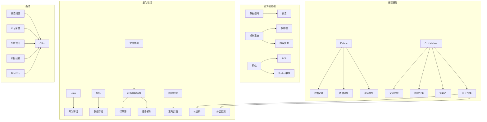

# 主脉络优化方案 · Implementation Plan

> **For agentic workers:** REQUIRED SUB-SKILL: Use superpowers:subagent-driven-development (recommended) or superpowers:executing-plans to implement this plan task-by-task.

**Goal:** 基于2026年5月招聘市场调研结果，修复主脉络.md的结构问题，补充关键缺口，提升路线图的准确性和可执行性

**当前问题诊断：**
1. 章节编号断裂（缺"五"，目标公司被吞入四-B）
2. 缺少实习策略专项（实习转正是核心入职通道，需要独立策略）
3. C++差异化价值强调不足（日薪2000 vs 400，5-10倍差距）
4. 缺少竞赛/GitHub具体时间节点
5. 技能树图未更新（缺数据采集、因子计算引擎）
6. 阶段5-6内容过简
7. 缺少投递策略与公司分层目标

**Tech Stack:** Obsidian Markdown, Mermaid

**文件范围（均在同一目录 `resources/`）：**
- `resources/主脉络.md`（修改，主体文件）
- `resources/招聘市场调研报告.md`（已创建，引用源）

---

## 一、修改清单

### 涉及文件

| 文件 | 操作 | 说明 |
|------|------|------|
| `resources/主脉络.md` | 修改 | 结构调整、内容增补 |
| `resources/招聘市场调研报告.md` | 已创建 | 引用源，本次不修改 |

### 主脉络.md 结构优化前后对比

**当前：**
```
一、岗位能力模型
二、目标就业画像
三、大时间线
四、阶段详细规划（阶段1-6）
四-B、招聘市场真实画像（插入到这里）
  第一梯队｜九坤投资 ...（目标公司被吸入这里）
六、技能树总图（缺五）
七、时间节点倒推
八、保底路线
各阶段详细计划（链接）
```

**目标：**
```
一、岗位能力模型
二、招聘市场真实画像（从四-B提上来，作为市场依据）
  2.1 岗位供需特点
  2.2 岗位实际工作内容
  2.3 竞品分析
  2.4 薪资全景图
三、目标就业画像（增强版：含GPA/GitHub/竞赛量化目标）
四、大时间线（Gantt图，更新标注竞赛窗口）
  4.1 阶段详细规划（阶段1-6，增强版）
  4.2 里程碑倒推表
五、实习策略专项（新增）
  5.1 实习时间线
  5.2 目标公司分层
  5.3 投递策略
  5.4 面试准备
六、目标公司与岗位要求（修复编号）
  6.1 第一梯队
  6.2 第二梯队
  6.3 实习友好公司
  6.4 保底路线
七、技能树总图（更新版）
八、竞赛与开源策略（新增）
  8.1 竞赛时间线
  8.2 GitHub运营策略
```

---

## 二、任务分解

### Task 1: 修复章节编号 + 重组结构

**文件：** `resources/主脉络.md`

**目的：** 把四-B（招聘市场真实画像）提升为独立的"二"；把目标公司修复为独立的"六"；更新所有后续编号。

**改动说明：**
- 将 四-B → 新"二、招聘市场真实画像"（放在一之后、三之前）
- 将散落在四-B中的目标公司内容 → 新"六、目标公司与岗位要求"
- 更新原"六、技能树" → 新"七、技能树"
- 更新原"七、时间节点" → 新"九、里程碑倒推"
- 更新原"八、保底路线" → 并入六的目标公司

注意：新增的"五、实习策略"、"八、竞赛与开源"会占用两个编号，所以时间节点会变成"十"。

---

### Task 2: 新增「二、招聘市场真实画像」（从四-B提取并增强）

**文件：** `resources/主脉络.md`

**目的：** 作为市场依据放在前面，让读者先看到"市场要什么"，再看"我们学什么"。

**内容：**

```
## 二、招聘市场真实画像

> 基于 BOSS直聘 + 猎聘 上海/北京/深圳三地2026年5月实时数据

### 2.1 岗位供需特点

| 维度 | 发现 |
|------|------|
| 应届机会 | 某百亿量化对冲基金招应届，30-60K |
| 实习转正 | 80%标注"留用机会"，实习是入职核心通道 |
| C++溢价 | C++强的实习生日薪2000-3000元，普通100-400元 |
| 学历门槛 | 本科及以上是主流，开发岗比研究员岗学历要求低 |
| 城市集中 | 上海（浦东/虹口）> 北京 > 深圳 |

### 2.2 岗位实际工作内容

| 模块 | 占比 | 对应技能 | 学习阶段 |
|------|------|---------|---------|
| 数据采集与清洗 | ~30% | Python/Pandas | 阶段1 |
| 回测系统开发 | ~25% | C++核心 | 阶段4 |
| 因子计算引擎 | ~20% | C++/Python | 阶段4 |
| 交易信号生成 | ~15% | C++多线程/网络 | 阶段6 |
| 执行监控与运维 | ~10% | 低延迟/Linux | 阶段6 |

### 2.3 竞品分析

| 竞争者类型 | 你的优势 | 你的劣势 |
|-----------|---------|---------|
| 985/211计算机科班 | 数学/统计基础更好，贴近业务 | 开发深度可能不如 |
| 金融工程/金融数学硕士 | 代码能力强，薪资期望低 | 学历不如 |
| 有经验的社招人员 | 应届薪资低、可塑性强 | 缺经验 |

**结论：** 开发岗比的是代码能力，学历权重低。数据科学专业是量化开发的"蓝海切入"。

### 2.4 实习生薪资真相

| 方向 | 日薪 | 月薪（按20天） | 年化 |
|------|------|--------------|------|
| Python数据处理 | 100-400元 | 2K-8K | 3-12万 |
| C++系统开发 | 2000-3000元 | 40K-60K | 48-72万 |
| 差距倍数 | **5-10倍** |||

> **一句话：C++能力决定薪资天花板。**
```

---

### Task 3: 增强「三、目标就业画像」

**文件：** `resources/主脉络.md`

**目的：** 把简历模板从"大概长这样"变成可量化的、有具体数字的目标。

**增强项：**
- 增加 GPA 目标（≥3.5/4.0）
- 增加 GitHub 量化目标（star数、commit频率、项目数）
- 增加 LeetCode 进度条
- 增加实习次数目标（2段：大二+大三）
- 增加竞赛奖项具体时间

---

### Task 4: 新增「五、实习策略专项」

**文件：** `resources/主脉络.md`

**这是最重要新增内容。** 基于调研发现"实习转正是核心入职通道"，需要完整的实习策略。

**内容结构：**

```
## 五、实习策略专项

### 5.1 两段实习时间线

| 时段 | 目标 | 公司层级 | 薪资参考 |
|------|------|---------|---------|
| 大二暑假 (2027.7-8) | 第一份实习练手 | 小私募/FinTech/券商IT | 100-400元/天 |
| 大三暑假 (2028.7-8) | 暑期实习转正 | 启林/顽岩/宽德等 | 2000-3000元/天 |

### 5.2 目标公司分层投递

| 层级 | 公司 | 投递时间 | 策略 |
|------|------|---------|------|
| 🌟 梦想 | 九坤、幻方 | 大三秋招 | 需要ACM/竞赛加持 |
| 🌟 主攻 | 启林、衍复、宽德、顽岩 | 大二下+大三 | 实习转正，最现实 |
| 🌟 保实习 | 爱凡哲、组优科技、天宝智算 | 大二下 | 经验不限本科 |
| 🌟 兜底 | FinTech/券商IT | 随时 | 积累开发经验 |

### 5.3 投递日历

| 时间 | 动作 | 准备工作 |
|------|------|---------|
| 大二上（2026.12） | 注册BOSS直聘+猎聘，完善在线简历 | 阶段1-2完成，GitHub有项目 |
| 大二寒假（2027.1-2） | 制作简历，找学长/老师修改 | 阶段3完成（C++深入） |
| 大二下开学（2027.2） | 开始海投，每天投3-5家 | 阶段4启动，有回测项目 |
| 大二下4月 | 集中面试，争取大二暑假实习 | LeetCode 200题+ |
| 大二暑假前（2027.6）| 确定实习offer | - |
| 大三上（2027.9） | 继续投大三暑期实习 | LeetCode 350题+ |
| 大三下（2028.2-6） | 冲刺暑期实习面试 | LeetCode 500题+ |

### 5.4 面试准备清单

```
□ 算法：LeetCode Medium 熟练，Hard 能解
□ C++八股：智能指针、虚函数、内存布局、STL源码
□ 系统设计：回测系统架构、订单管理系统、低延迟要点
□ 项目深挖：简历上每个项目都能讲30分钟
□ 金融基础：股票/期货交易规则、订单簿、撮合机制
□ 行为面试：为什么量化？为什么开发不是研究？
```
```

---

### Task 5: 修复「六、目标公司与岗位要求」

**文件：** `resources/主脉络.md`

**目的：** 把散落在四-B中的目标公司表格整理成独立编号章节，补充新发现的实习友好公司。

**改动：**
- 从当前四-B后面提取所有公司表格
- 补充 爱凡哲投资、组优科技、天宝智算、量魁私募 等新发现公司
- 增加「实习友好公司」分组
- 薪资数据更新为实际招聘数据

---

### Task 6: 更新「技能树总图」（Mermaid）

**文件：** `resources/主脉络.md`

**目的：** 补充缺失的数据采集/ETL、因子计算引擎节点。

**新图结构：**


---

### Task 7: 新增「竞赛与开源策略」

**文件：** `resources/主脉络.md`

**目的：** 量化竞赛和GitHub运营是简历加分关键，需要具体时间线。

**内容：**

```
## 八、竞赛与开源策略

### 8.1 竞赛时间线

| 时间 | 竞赛 | 准备 | 目标 |
|------|------|------|------|
| 2026.9 | 数学建模国赛 | 阶段1完成，Python可用 | 省二以上 |
| 2027.2 | 美赛（MCM/ICM） | Python数据分析+论文 | H奖以上 |
| 2027.6 | WorldQuant Challenge | Python+因子研究 | 积累量化经验 |
| 2027.9 | 数学建模国赛（二刷） | 更多经验 | 省一/国奖 |
| 持续 | Kaggle/天池量化比赛 | 随时 | 丰富简历 |

### 8.2 GitHub运营策略

| 阶段 | 目标 | 动作 |
|------|------|------|
| 阶段1 | 3个仓库 | Python小项目+股票分析工具 |
| 阶段2 | 5个仓库 | 算法题解仓库(C++) |
| 阶段3 | 持续提交 | C++项目上传，每天小commit |
| 阶段4 | ⭐核心项目上线 | 回测引擎开源，写README |
| 阶段5-6 | 积累stars | 在知乎/技术社区分享项目 |

### 8.3 技术博客（加分项）

推荐在知乎/掘金写量化开发学习笔记：
- 《从零写一个回测引擎》
- 《C++智能指针在量化系统里的应用》
- 《我是如何在本科阶段拿到量化私募实习的》
```
---

### Task 8: 增强「阶段5-6」内容

**文件：** `resources/主脉络.md`

**目的：** 当前阶段5只有几句话，阶段6也比较简略。补充具体执行内容。

**阶段5增强：**
```
### 阶段5：第一份实习（大二暑假 7-8月）

> 目标：拿到offer并活下来

**实习前（4-6月）：**
- 完善GitHub，确保项目有README和文档
- 刷LeetCode到200题
- 准备C++八股文
- 海投简历（BOSS直聘+猎聘+公司官网）

**实习中（7-8月）：**
- 每天写工作日志
- 主动要任务，别等着被分配
- 跟同事学代码规范、工程实践
- 了解量化业务全流程
- 争取留下好印象以便之后要推荐信

**产出：**
- 一段真实量化开发经历（简历核心卖点）
- 实习证明+推荐信
- 明确大三方向（继续量化 or 转互联网）
```

**阶段6增强：**
```
### 阶段6：冲刺 + 秋招（大三 9月-大四6月）

**技术冲刺（9-12月）：**
- C++进阶：低延迟优化、内存对齐、缓存优化、SIMD
- 分布式系统基础：ZeroMQ、通讯协议
- 交易系统架构：订单管理、风控、行情接入
- 项目：用C++实现简易交易引擎（订单簿+撮合+风险管理）

**面试准备（1-4月）：**
- LeetCode 500题（250 Medium + 100 Hard）
- C++八股系统性复习
- 系统设计题专项（设计回测系统、设计订单系统）
- 模拟面试（找学长/付费模拟）

**投递策略（2-6月）：**
- 2月：投大厂暑期实习（量化私募+互联网后端双线）
- 3-4月：集中面试
- 5-6月：确定暑期实习offer
- 7-8月：暑期实习（争取转正）
- 9月：秋招正式批，拿offer
```

---

### Task 9: 更新「里程碑倒推表」

**文件：** `resources/主脉络.md`

**目的：** 补充竞赛、GitHub、简历准备等节点。

**新表：**
```
| 时间 | 必须完成的事 |
|------|------------|
| 大三暑假 (2028.7) | 🏢 暑期实习转正 / 秋招拿offer |
| 大三下学期 (2028.2-6) | 📮 海投暑期实习，LeetCode 500题 |
| 大三上学期 (2027.9-2028.1) | 📝 数模国赛二刷，LeetCode 350题 |
| 大三开学前 (2027.9) | 🌟 GitHub有回测引擎项目+README |
| 大二暑假 (2027.7-8) | 🏢 第一份实习（小私募/FinTech） |
| 大二下学期 (2027.2-6) | 📮 投递实习，制作简历，LeetCode 250题 |
| 大二寒假 (2027.1-2) | 🏆 美赛，C++深入项目 |
| 大二上学期 (2026.9-2027.1) | 📝 数模国赛，LeetCode 100题，C++入门 |
| 大一暑假 (2026.7-8) | 🐍 Python项目完成，GitHub建仓 |
| 现在 (2026.5) | 🚀 Python入门 |
```

---

## 三、执行顺序

| 序号 | 任务 | 预估时间 | 依赖 |
|------|------|---------|------|
| 1 | Task 1: 修复章节编号 | 5min | 无 |
| 2 | Task 2: 招聘市场画像（提取+增强）| 10min | 无（已有素材）|
| 3 | Task 3: 增强目标就业画像 | 5min | 无 |
| 4 | Task 4: 新增实习策略专项 | 15min | 无（核心新增）|
| 5 | Task 5: 修复目标公司章节 | 10min | Task 1 |
| 6 | Task 6: 更新技能树图 | 5min | 无 |
| 7 | Task 7: 新增竞赛与开源策略 | 10min | 无 |
| 8 | Task 8: 增强阶段5-6 | 10min | Task 1 |
| 9 | Task 9: 更新里程碑倒推表 | 5min | 无 |
| 10 | 全局自检（编号/链接/一致性）| 5min | 全部完成 |

**总预估：** 约80min

---

## 四、自检清单

- [ ] 所有章节编号连续（一→十，没有断裂）
- [ ] Wikilinks `[[]]` 全部有效
- [ ] Mermaid 图语法正确
- [ ] 新薪资数据与调研报告一致
- [ ] 时间线中月份与阶段持续时间一致
- [ ] 没有悬挂的"四-B"引用
- [ ] 实习策略中的投递日历与里程碑倒推表一致

---

## 执行方式

**Plan complete and saved to `docs/superpowers/plans/2026-05-25-主脉络优化方案.md`.**

**推荐：Inline Execution** — 因为所有改动都在同一个文件（主脉络.md），逐个任务顺序执行，每次修改后检查一致性更方便。
