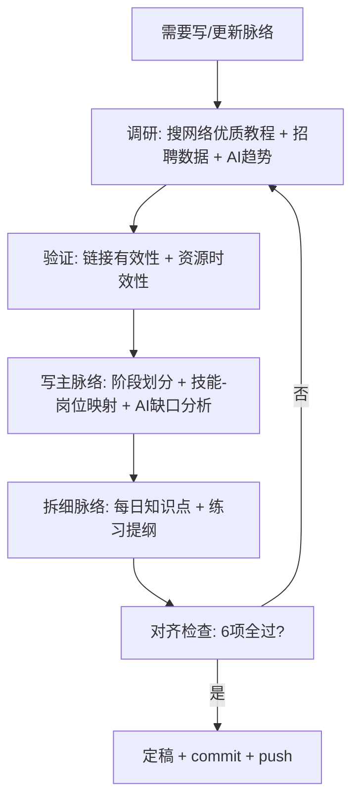

# 写脉络流程

> 当需要创建新阶段大纲或更新现有大纲时, 按此流程执行.
> 触发条件: 新阶段开始 | 细脉络不存在 | 细脉络与主脉络不匹配

---

## 流程总览



---

## 步骤详解

### Step 1: 调研

搜索 Python/C++/量化开发/AI大模型 的优质教程 + 招聘数据:

- 主流课程怎么组织知识点顺序
- 每个阶段覆盖哪些内容
- **AI技能在2026年JD中的出现频率** + AI岗位市场数据
- 量化开发岗位的技能需求变化
- **Datawhale AI教程体系**(LLM Cookbook/Happy-LLM/easy-vibe等)的结构

参考源:
- Python: CS50P, Real Python, Python官方 Tutorial
- C++: learncpp.com, cppreference
- AI量化: Qlib(RD-Agent), AlphaCrafter, FinRL-X
- **AI应用**: Datawhale教程体系, LangChain官方文档, HuggingFace课程
- 招聘: BOSS直聘, 猎聘, 牛客网, 知乎, 脉脉高聘

### Step 2: 资源验证 + 持续更新

确认所有链接有效, 资源时效性:

- B站链接是否可访问
- GitHub star 数是否最新
- 教程发布日期是否过时(超过2年需标注)
- 薪资数据来源是否可追溯
- **每进入新阶段前, 重新调研一次对应教程** (不是只调研一次)
- **写每天课程前参考资源库对应章节**, 糅合多家之长

### Step 3: 写主脉络

`resources/主脉络.md` 包括:

1. **阶段划分** — 6阶段从Python到量化系统
2. **技能-岗位映射表** — 每个技能对应哪些岗位要求, 标注匹配度
3. **AI缺口分析** — 哪些AI技能当前未覆盖, 在哪里补充
4. **里程碑** — 每个阶段结束时用户能做什么

### Step 4: 拆细脉络

`docs/plans/阶段X_分脉络大纲.md` 按天拆分:

```
## Day X - 标题

### 教学内容
- 知识点列表 (含前置依赖标记, 量化场景)
- 练习规划 (难度递进)

### 依赖清单
本 day 用到的所有 Python 类型/语法, 标注来源 day
```

### Step 5: 对齐检查 (6项)

| 检查项 | 标准 | 不通过则 |
|--------|------|----------|
| 1. 主脉络 vs 岗位需求 | 每个知识点对应用人需求? | 增删技能 |
| 2. AI缺口检查 | 当前阶段是否有AI技能覆盖? | 补充AI内容 |
| 2b. **AI辅线覆盖** | 本阶段是否有对应的AI学习内容? | 按量化:AI=60:40分配 |
| 3. 细脉络 vs 主脉络 | 细脉络覆盖了主脉络的阶段内容(含AI)? | 调整细脉络 |
| 4. 细脉络内部依赖 | Day N 用的前置已在 Day < N 教过? | 重排顺序 |
| 5. 练习 vs 知识点 | 每个知识点有对应的练习? | 补练习 |
| 6. 资源时效性 | 所有链接有效, 数据可追溯? | 更新或标注 |

### Step 6: 定稿

- 更新 `resources/主脉络.md`
- 创建/更新 `docs/plans/阶段X_分脉络大纲.md`
- 如有新的教学约束, 写入 memory/
- 更新 `.claude/CLAUDE.md` 的 `## 当前状态`
- commit + push (一气呵成)
