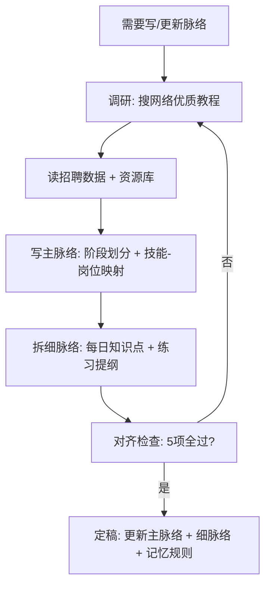

# 写脉络流程

> 当需要创建新阶段大纲或更新现有大纲时, 按此流程执行.
> 触发条件: 新阶段开始 | 细脉络不存在 | 细脉络与主脉络不匹配

---

## 流程总览



---

## 步骤详解

### Step 1: 调研

搜索 Python/C++/量化开发 的优质教程, 了解:

- 主流课程怎么组织知识点顺序
- 每个阶段覆盖哪些内容
- 练习/项目设计模式

参考源:
- Python: CS50P, Real Python, Python官方 Tutorial, Exercism
- C++: learncpp.com, cppreference
- 量化开发: 招聘数据中的技能要求

输出: 调研笔记 (知识点顺序、重点、常见坑)

### Step 2: 读招聘数据 + 资源库

确认市场需求和已有资源:

- `resources/lib/资源库.md` -- 有哪些书籍/教程可用
- 招聘市场调研报告 -- 岗位要求哪些技能
- 用户背景 (`个人信息.md`) -- 时间预算、目标城市、优先级

### Step 3: 写主脉络

`resources/主脉络.md` 包括:

1. **阶段划分** -- 6阶段: Python -> C++ -> 数据结构 -> 数据处理 -> 数据库 -> 量化入门
2. **技能-岗位映射表** -- 每个技能对应哪些岗位要求
3. **里程碑** -- 每个阶段结束时用户能做什么

### Step 4: 拆细脉络

`docs/plans/阶段X_分脉络大纲.md` 按天拆分:

```
## 第 Y 天 - 标题

### 教学内容
- 知识点列表 (含前置依赖标记)
- C++ 对照点
- 量化场景

### 练习规划
- 基础练习: 数量, 考察点
- 综合练习: 描述

### 依赖清单
本 day 用到的所有 Python 类型/语法, 标注来源 day
```

### Step 5: 对齐检查 (5项)

| 检查项 | 标准 | 不通过则 |
|--------|------|----------|
| 1. 主脉络 vs 岗位需求 | 每个知识点对应用人需求? | 增删技能 |
| 2. 细脉络 vs 主脉络 | 细脉络覆盖了主脉络的阶段内容? | 调整细脉络 |
| 3. 细脉络内部依赖 | Day N 用的前置已在 Day < N 教过? | 重排顺序 |
| 4. 练习 vs 知识点 | 每个知识点有对应的练习? | 补练习 |
| 5. 记忆规则 | 逐行拆解? 英文符号? 难度递进? | 修改教学方式 |

### Step 6: 定稿

- 更新 `resources/主脉络.md`
- 创建/更新 `docs/plans/阶段X_分脉络大纲.md`
- 如有新的教学约束, 写入 memory/
- 更新 `.claude/CLAUDE.md` 的 `## 当前状态`

---

## 举例

> 场景: 阶段1 Python 刚开始时, 主脉络已经写了"第1周 Python语法",
> 但没有细脉络.
>
> 1. 调研: 看 CS50P 的前7天怎么分, Real Python 的基础部分怎么组织
> 2. 读招聘数据: 量化开发要求 Python 基础 (list/dict/set/文件IO/异常/OOP)
> 3. 写主脉络: 确定 Python 阶段分 3 部分共 17 天
> 4. 拆细脉络: Day 01 起步, Day 02 列表字典, Day 03 函数, Day 04 set+文件+异常...
> 5. 对齐检查: Day 02 涉及 tuple 吗? 不涉及 -> 放到 Day 03 *args 时一起教
> 6. 定稿: 创建 docs/plans/阶段1_Python_分脉络大纲.md, 更新主脉络状态
