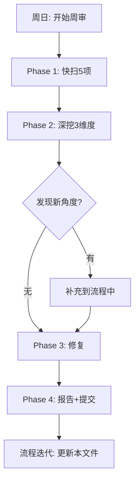

# 每周优化审查流程

> 每周日执行一次，对整个项目做系统优化审查。
> 逐轮覆盖新角度，每轮发现新问题后把步骤写进流程，流程本身也进化。

---

## 流程总览



---

## Phase 1: 快扫 (30分钟)

> 先用 grep/glob/bash 快速扫描整个项目，定位问题区域。
> 这步不做深度分析，只标记"有问题"和"没问题"。

### Step 1.1 进度核实

```bash
# 核对当前进度
grep -n "Day\|已完成\|当前状态" .claude/CLAUDE.md resources/主脉络.md docs/plans/阶段*_分脉络大纲.md
```

检查清单:
- [ ] 主脉络进度 vs 细脉络进度 vs 实际文件数 三者一致
- [ ] `.claude/CLAUDE.md` 的 `当前状态` 是最新的
- [ ] 细脉络中当前 Day 的标记正确 (✅/⏳/▶)
- [ ] 细脉络的下一个 Day 有明确的教学内容描述

### Step 1.2 C++ 对比扫描

```bash
# 统计所有 .py 中的 C++ 提及
grep -rn "C++" projects/python/stage*/day*.py
```

检查清单:
- [ ] 上次标记的 C++ 对比数量是否有新增/减少
- [ ] Day 06+ 的新文件是否有新的 C++ 对比引入 (应该为0)
- [ ] 如果有新文件引入了 C++ 对比，标记为待修复

### Step 1.3 练习区合规扫描

```bash
# 检查每个练习区是否被预填了答案
grep -A2 "# ↓ 你的代码 ↓" projects/python/tutorials/day*.py
```

检查清单:
- [ ] 本周新写的 day 文件，练习区是否全部留空 (不含用户填的)
- [ ] 综合练习区是否干净 (无 demo 代码)
- [ ] 如果发现我预填了答案，立即标记为 P0 修复

### Step 1.4 依赖包检查

```bash
# 检查所需包是否仍在
cd .venv/Scripts && python -c "
import numpy
import pandas
import matplotlib
import requests
import yfinance
import pytest
" && echo "ALL OK"
```

检查清单:
- [ ] 所有 `requirements.txt` 中的包可 import
- [ ] 如果新增了包依赖，确认已安装并更新 `requirements.txt`
- [ ] pip 版本是否过旧 (更新提醒)

### Step 1.5 环境垃圾检查

```bash
# 检查不应被跟踪的文件
git status --short
# 检查垃圾文件
ls *.tmp _flash_log.txt report.txt null 2>/dev/null && echo "JUNK FOUND" || echo "CLEAN"
```

检查清单:
- [ ] 没有未被 gitignore 覆盖的垃圾文件
- [ ] `.codegraph/` 没有残留锁定文件
- [ ] `output/` 目录不包含 git-tracked 文件
- [ ] `__pycache__/` 被正确 gitignored

---

## Phase 2: 深挖 (60+分钟)

> 步骤 2.1-2.5 可以并行执行（Workflow 或 Agent 并行）。
> 步骤 2.6 需要合成以上所有发现。

### Step 2.1 课程质量审计

对每个 day 文件，检查以下维度:

```python
审计维度 = {
  "依存表": "文件顶部是否有依赖清单?",
  "进度显示": "开头是否有进度条?",
  "教学深度": "每参数是否拆解? 量化场景? 常见坑?",
  "练习密度": "难度递进(填空→补全→实现)? 数量合理?",
  "练习合规": "练习区是否留空? 描述是否泄漏答案?",
}
```

可以用 Workflow 并行分析多个 day 文件:
```javascript
// 7 代理并行，每代理分析一个 day + 遗漏.py
const agents = await parallel([
  () => agent("Check day01", {phase: "审计Day"}),
  () => agent("Check day02", {phase: "审计Day"}),
  // ... 每个 Day 一个代理
])
```

检查清单:
- [ ] 每个 day 的教学深度达标 (参数拆解/量化场景/常见坑)
- [ ] 每个 day 的练习密度合理 (10-15小练习/综合)
- [ ] 每个 day 的练习区合规 (空/描述不泄漏)
- [ ] 遗漏.py 内容是否对应了某 Day 的缺口
- [ ] 知识点覆盖是否有新缺口 (对比已教 vs 技能需求矩阵)

### Step 2.2 技能需求-权重复盘

检查 `docs/plans/技能需求-权重矩阵.md`:

- [ ] 当前权重是否仍符合最新招聘趋势 (权重矩阵的前言日期)
- [ ] 如果距离上次权重矩阵更新已超过 3 个月，重新 Web 搜索调研
- [ ] 当前阶段的教学内容，是否匹配权重最高的技能
- [ ] 是否有低权重技能占用了过多教学时间 (可压缩)

### Step 2.3 脉络对齐检查

对比三个文件的进度:

| 文件 | 位置 |
|------|------|
| `resources/主脉络.md` | `十二.学习管理方法 > 进度追踪` 表 |
| `docs/plans/阶段X_分脉络大纲.md` | Day 状态标记 |
| `.claude/CLAUDE.md` | `当前状态` 节 |

检查清单:
- [ ] 细脉络的 Day 数量 vs 主脉络的周数是否匹配
- [ ] 细脉络的总览结构和详细节是否有矛盾 (上次修了 3 处)
- [ ] AI 技能线的教学计划是否有更新
- [ ] 下个 Day 的前置依赖是否全部已教 (做依赖检查)

### Step 2.4 记忆规则遵循审计

对照 `memory/MEMORY.md` 中所有规则，检查新写的文件是否遵循:

| 规则 | 检查方法 |
|------|---------|
| exercises-must-be-empty | grep 练习区确认空 |
| teaching-explain-every-step | 抽查教学段是否有参数拆解 |
| curriculum-prerequisite-check | 依赖表 vs 实际内容 |
| daily-progress-display | 文件开头是否有进度显示 |
| commit-before-after-lesson | git log 是否有课前后 commit |
| never-fabricate | 是否有无法验证的数据/链接 |

### Step 2.5 新角度发现 (关键!)

这是每周的核心步骤——寻找之前没注意到的优化角度。

**从哪里找新角度:**

| 来源 | 方法 |
|------|------|
| 本周写课中的翻车/纰漏 | 回顾这周写课时的反复修正 (从 conversation 中找) |
| 用户的抱怨/建议 | 用户这周提了什么改进意见? |
| 招聘市场变化 | 重搜一次量化开发 JD, 看有什么新技能要求 |
| 新技术/工具出现 | 有没有新的 AI 编程工具、量化框架、教程出现? |
| 自己的"要是刚才有检查就好了" | 哪个步骤如果能提前检查就能避免出错? |

**如果发现新角度:**
1. 立刻在本流程文档中新增步骤
2. 在 Step 3 中实施修复
3. 在报告中说明新增了哪个步骤

### Step 2.6 合成优先级

把以上所有发现合成到一个按优先级排序的修复列表:

```markdown
| 优先级 | 问题 | 类型 | 修复难度 |
|--------|------|------|---------|
| 🔴 P0 | 卡住后续学习 | 阻塞 | 高/中/低 |
| 🟡 P1 | 严重影响质量 | 质量 | 高/中/低 |
| 🟢 P2 | 可以改进 | 优化 | 高/中/低 |
```

---

## Phase 3: 修复 (按优先级)

### Step 3.1 P0 修复

P0 = 如果不修，下周学习无法继续或会产生大量错误理解。

典型 P0:
- 依赖包未安装
- 教学知识有严重错误
- 下个 Day 的前置依赖空缺
- 练习答案预填

### Step 3.2 P1 修复

P1 = 明显降低学习质量，但不会堵塞进度。

典型 P1:
- 教学深度不够 (参数没拆解)
- 练习密度不合理
- 脉络文档矛盾
- 遗漏知识点未标记

### Step 3.3 P2 修复

P2 = 「做了更好」的改进。

典型 P2:
- 文档格式优化
- 冗余清理
- 额外的附加题

---

## Phase 4: 报告 + 提交

### Step 4.1 写周审报告

写入 `docs/audit-YYYY-MM-DD.md`:

```markdown
# 周审报告 — YYYY-MM-DD (第N次)

## 本次覆盖
- 本周进度: Day X → Day Y
- 审计范围: [快扫+课程审计+脉络对齐+...]
- 新发现角度: [如果有]

## 发现的全部问题
| # | 优先级 | 问题 | 状态 |
|---|--------|------|------|
| 1 | P0 | xxx | 已修复/待修复 |

## 修复总结
| 修复项 | 操作 | 文件 |
|--------|------|------|
| xxx | xxx | xxx |

## 未修复/不可修复
| 问题 | 原因 |
|------|------|

## 流程迭代
本周新增的检查步骤: [步骤名]
本周移除了: [不需要的步骤]
```

### Step 4.2 更新流程

在写完报告后，更新本文件:
- 新增本周发现的新角度对应的检查步骤
- 移除不再需要的旧步骤
- 优化现有步骤的描述

### Step 4.3 提交

```bash
git add -A
git commit -m "周审 YYYY-MM-DD: 审计修复+流程迭代"
git push
```

---

## 第1次 (2026-05-31) 产出物

第一轮周审的产出物是以下文件，作为后续周审的基线:

| 产出 | 位置 |
|------|------|
| 全面审计报告 V2 | `docs/audit-2026-05-31.md` |
| 技能需求-权重矩阵 | `docs/plans/技能需求-权重矩阵.md` |
| 本周审流程 | `docs/workflows/周审流程.md` (本文件) |
| 细脉络矛盾修复 | `docs/plans/阶段1_Python_分脉络大纲.md` |
| C++对比基线 | `projects/python/stage*/day*.py` (46处已标记不可改) |
| 依赖包基线 | `.venv/` (numpy/pandas/matplotlib/requests/yfinance/pytest/jupyter) |

---

## 各次周审记录

| 周次 | 日期 | 覆盖 | 新发现角度 | 流程迭代 |
|------|------|------|-----------|---------|
| 1 | 2026-05-31 | 全量审计 | 技能权重矩阵; 脉络对齐矛盾; 依赖包缺失; 练习区合规 | 初始创建 |
| 2 | 2026-06-07 | ⏳ | ⏳ | ⏳ |
| 3 | 2026-06-14 | ⏳ | ⏳ | ⏳ |

---

## 附录: 常用审计命令

```bash
# C++ 对比统计
grep -rn "C++" projects/python/stage*/day*.py | grep -v "无 C++ 对比"

# 练习区扫描
grep -rn "# ↓ 你的代码 ↓" projects/python/stage*/day*.py

# 进度检查
head -30 .claude/CLAUDE.md | grep "已完成\|已完成:"

# 脉络冲突检查
grep -n "Day 0[1-9]" docs/plans/阶段1_Python_分脉络大纲.md | head -20

# 垃圾文件
git status --short
ls *.tmp _flash_log.txt report.txt null output/*.csv 2>/dev/null

# 包检查
.venv/Scripts/python -c "
deps = {'numpy':'numpy','pandas':'pandas','matplotlib':'matplotlib',
        'requests':'requests','yfinance':'yfinance','pytest':'pytest'}
missing = []
for name, mod in deps.items():
    try: __import__(mod); print(f'  ✅ {name}')
    except: missing.append(name); print(f'  ❌ {name}')
if missing: raise SystemExit(f'Missing: {missing}')
"
```
