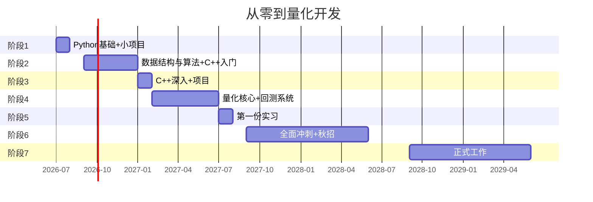

# 量化开发学习就业规划 · 主脉络

> [!abstract] 个人档案
> **学校：** 中国地质大学（武汉）
> **专业：** 数据科学与大数据技术
> **年级：** 2025级（大一 → 大二）
> **目标岗位：** 量化开发工程师
> **城市偏好：** 上海 > 北京 > 深圳 > 杭州 > 武汉

---

## 🗺️ 大时间线

---

## 📋 阶段总览

| 阶段 | 时间 | 核心内容 | 里程碑 |
|------|------|---------|--------|
| [[阶段1-暑假Python基础\|阶段1 - Python基础]] | 2026暑假(49天) | Python语法 → 数据处理 → 3个小项目 | GitHub建仓，跑通第一个项目 |
| **阶段2 - 算法+C++入门** | 2026大二上(9-1月) | 数据结构与算法刷题 + C++基础语法 | LeetCode 100题 |
| **阶段3 - C++深入** | 2027寒假(~30天) | C++核心特性 + 小项目 | 能独立写C++项目 |
| **阶段4 - 量化核心** | 2027大二下(2-7月) | 回测系统 + 数据处理 + 金融基础 | 完整回测项目，LeetCode 250题 |
| **阶段5 - 第一份实习** | 2027暑假 | 投递+面试+实习 | 量化/FinTech实习经历 |
| **阶段6 - 冲刺+秋招** | 2028大三 | 交易系统 + 面试准备 + 投递 | LeetCode 500题，拿offer |
| **阶段7 - 毕业** | 2029大四 | 转正 / 入职 | 正式工作 |

---

## 📌 关键节点

> [!tip] 第一年关键目标
> - **2026年8月** — GitHub建仓完毕，有3个Python项目
> - **2026年9月** — 🏆 数学建模国赛
> - **2027年1月** — LeetCode 100题达成，C++能写简单程序
> - **2027年4-5月** — 📮 投递大二暑期实习

> [!warning] 第二年冲刺
> - **2027年7月** — 📮 第一份实习
> - **2027年9月** — 🏆 数学建模国赛/美赛
> - **2028年3月** — 📮 大三暑期实习投递季

> [!success] 毕业目标
> - **2028年7月** — 💼 暑期实习（转正通道）
> - **2028年9月** — 💼 秋招
> - **2029年6月** — 🎓 毕业+入职

---

## 🏢 目标公司清单

### 第一梯队（头部量化私募）
上海：九坤、幻方、衍复、明汯、启林
北京：九坤(研发) / 幻方(研发)
深圳：幻方量化

### 第二梯队（腰部量化/自营）
上海：宽德、蒙玺、天演、思勰
其他：杭州龙旗、北京信弘

### 第三梯队（FinTech/券商开发）
各大券商IT部门 / 恒生电子 / 金证股份
互联网公司金融部门

---

## 🛡️ 保底路线

> [!info] 如果量化未如愿
> 技术栈可平移到：
> - **C++后端开发**（腾讯、字节、美团等）
> - **Python后端/数据开发**（各类互联网公司）
> - **金融科技开发**（券商、银行IT部门）
>
> 核心技能（数据结构+算法+系统设计+C++/Python）完全通用，**不亏**。

---

## 📂 文档索引

| 阶段 | 文档 | 状态 |
|------|------|------|
| 阶段1 | [[阶段1-暑假Python基础]] | ✅ 已发布 |
| 阶段2 | 数据结构与算法 | 📅 2026年8月更新 |
| 阶段3 | C++深入 | 📅 2027年1月更新 |
| 阶段4 | 量化核心 | 📅 2027年2月更新 |
| 阶段5+6 | 冲刺+秋招 | 📅 2027年9月更新 |
| 学习日志 | [[日志/索引]] | 📝 每日更新 |

> [!note] 机制说明
> 每周计划动态调整，请在 [[日志/索引\|学习日志]] 中记录每日进度。
> 当前阶段结束后，下阶段计划会根据实际情况重新制定。
