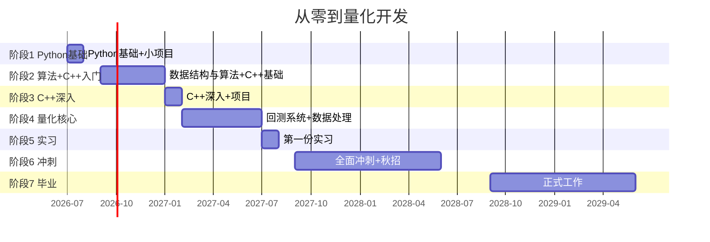

# 量化开发学习就业规划 · 主脉络

> [!abstract] 背景档案 → 详见 [[个人信息]]

## 总目标

毕业时具备入职**量化开发（Quant Developer）岗**的能力，同时以**互联网后端开发**为保底。

## 大时间线

## 阶段总览

| 阶段 | 时间 | 核心内容 | 里程碑 |
|------|------|---------|--------|
| **阶段1** — Python基础 | 2026暑假(49天) | 语法→数据处理→3个项目 | GitHub建仓 |
| **阶段2** — 算法+C++入门 | 2026大二上 | 刷题+C++基础 | LeetCode 100题 |
| **阶段3** — C++深入 | 2027寒假 | C++核心特性+项目 | 独立写C++项目 |
| **阶段4** — 量化核心 | 2027大二下 | 回测系统+金融基础 | LeetCode 250题 |
| **阶段5** — 第一份实习 | 2027暑假 | 投递+面试+实习 | 实习经历 |
| **阶段6** — 冲刺+秋招 | 2028大三 | 交易系统+面试准备 | LeetCode 500题 |
| **阶段7** — 毕业 | 2029大四 | 转正/入职 | 正式工作 |

## 关键节点

- **2026年8月** — GitHub 建仓完毕，3个Python项目
- **2026年9月** — 🏆 数学建模国赛
- **2027年1月** — LeetCode 100题达成
- **2027年4-5月** — 📮 投递大二暑期实习
- **2027年7月** — 📮 第一份实习
- **2028年3月** — 📮 大三暑期实习投递
- **2028年9月** — 💼 秋招
- **2029年6月** — 🎓 毕业+入职

## 目标公司

- **第一梯队（头部私募）：** 九坤、幻方、衍复、明汯、启林（上海/北京）
- **第二梯队（腰部私募）：** 宽德、蒙玺、天演、思勰（上海）
- **第三梯队（FinTech）：** 券商IT部门、恒生电子、互联网公司金融部门

## 保底路线

> 量化未如愿 → 平移到 C++后端 / Python后端 / 金融科技开发，核心技能完全通用。

## 各阶段详细计划

所有阶段详细到天计划见 [[../notes/README.md|Obsidian 库主页]]。
