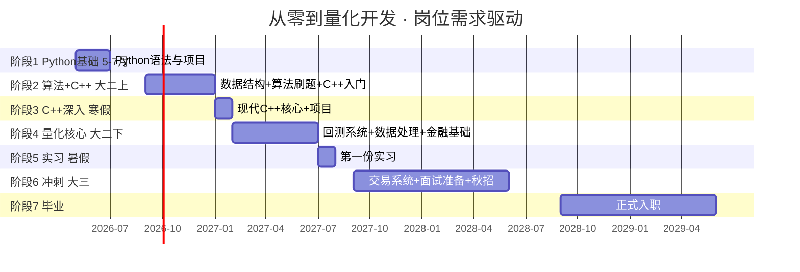
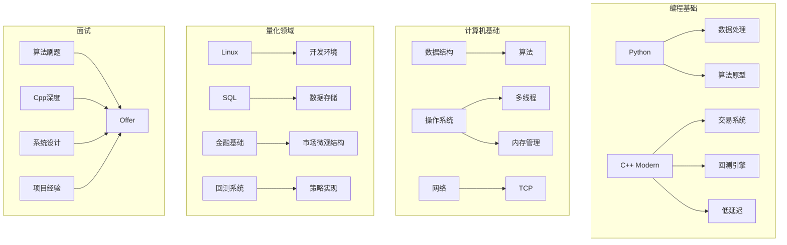

# 量化开发学习就业规划 · 主脉络

> [!abstract] 背景档案 → 详见 [[个人信息]]
> 本路线图基于 BOSS直聘/Liepin 等平台真实岗位要求编制。

---

## 一、岗位能力模型

### 市场真实需求（来自招聘网站）

| 技能项 | 出现频率 | 要求程度 | 对应学习阶段 |
|--------|---------|---------|------------|
| **C++** (11/14/17/20) | 极高 (90%+) | 核心语言，必须精通 | 阶段2-3 |
| **Python** (数据处理) | 极高 (90%+) | 辅助/原型语言，必须熟练 | 阶段1 |
| **数据结构与算法** | 高 (80%+) | 面试必考，工作中高频使用 | 阶段2 |
| **Linux系统** | 高 (80%+) | 开发环境，常用命令、Shell | 阶段3 |
| **网络编程** (TCP/UDP) | 中高 (60%+) | 交易系统通信基础 | 阶段4 |
| **多线程/多进程** | 高 (80%+) | 性能关键，高频交易核心 | 阶段4 |
| **数据库** (SQL) | 中 (50%+) | 数据存储/回测结果管理 | 阶段4 |
| **Git** | 高 (80%+) | 日常工作必备 | 阶段1 |
| **金融基础知识** | 中 (50%+) | 股票/期货/期权基础概念 | 阶段4 |
| **低延迟优化** | 中 (40%+) | 进阶技能，头部私募必备 | 阶段6 |
| **分布式系统** | 中 (40%+) | 大规模数据处理 | 阶段6 |

> [!info] 学历门槛
> 量化开发 >80% 岗位要求本科及以上，对学历要求明显低于量化研究员（后者通常要求硕士起步）。这是数据科学专业本科生**最现实的切入点**。

### 面试流程

```
简历筛选 → 在线笔试(算法题) → 技术一面(C++/Python) → 技术二面(系统设计) → HR面 → Offer
```

核心考察点：
1. **编程能力**（手写代码，LeetCode Medium/Hard）
2. **C++深度**（内存管理、模板、性能优化）
3. **系统设计**（如何设计一个回测系统、订单管理系统）
4. **项目经验**（GitHub 上的个人项目、实习项目）

---

## 二、目标就业画像

### 大四毕业时你的简历应该长这样

```
【教育】
中国地质大学（武汉）· 数据科学与大数据技术 · 本科

【编程语言】
- C++：精通现代C++(11/14/17)，熟悉STL、内存管理、多线程
- Python：熟练使用NumPy/Pandas进行数据处理，能快速开发原型

【项目经验】
- 股票回测系统：支持多因子回测、绩效分析（C++实现）
- 订单管理模拟系统：处理订单簿、撮合逻辑（C++实现）
- 多因子分析框架：因子计算、IC分析、分层回测（Python实现）
- 个人GitHub：500+ stars，持续活跃

【竞赛】
- 数学建模国赛/美赛（省级以上奖项）
- WorldQuant Challenge 或其他量化比赛

【实习】
- 量化私募/FinTech公司 量化开发实习（至少一段）
```

---

## 三、大时间线



---

## 四、阶段详细规划

### 阶段1：Python基础 → 任务驱动入门（5月-7月，7周）

> [!tip] 岗位对应：Python数据处理能力、Git、第一个项目

| 周 | 内容 | 产出 |
|----|------|------|
| 1-2 | Python语法基础（变量/控制流/函数/数据结构） | 小脚本 |
| 3 | OOP+进阶特性 | 小项目：银行系统 |
| 4-5 | NumPy/Pandas/Matplotlib | 数据处理能力 |
| 6 | 综合项目：股票分析工具 | Git项目 |
| 7 | 复习+阶段考试 | - |

**目标：** GitHub有3+项目，能独立处理数据分析任务

---

### 阶段2：数据结构与算法 + C++入门（大二上 9-1月）

> [!tip] 岗位对应：面试手撕代码、C++基础

**内容：**
- 数据结构：数组/链表/栈/队列/树/图/哈希表/堆
- 算法：排序/搜索/动态规划/贪心/回溯
- 刷题计划：LeetCode 100题（50 easy + 40 medium + 10 hard）
- C++入门：语法、STL、面向对象

**目标：** LeetCode 100题，能写C++程序

---

### 阶段3：C++深入（寒假 1-2月）

> [!tip] 岗位对应：C++是量化开发第一语言，必须过硬

**内容：**
- 现代C++：智能指针、lambda、移动语义、右值引用
- 内存管理：栈/堆、RAII、内存池
- STL源码理解
- 小项目：高性能计算工具

**目标：** 独立写C++项目，理解内存模型

---

### 阶段4：量化核心 + 回测系统（大二下 2-7月）

> [!tip] 岗位对应：Linux/多线程/网络/数据库/金融基础

**内容：**
- Linux开发环境 + Shell脚本
- 多线程编程（C++ thread、同步、锁）
- 网络编程基础（socket、TCP/UDP）
- SQL数据库
- 金融基础（股票/期货/期权、交易规则）
- **核心项目：** 用C++实现简易回测引擎

**目标：** LeetCode 250题，可投大二暑期实习

---

### 阶段5：第一份实习（大二暑假 7-8月）

> [!tip] 目标公司：小私募 / FinTech公司 / 券商IT

**任务：**
- 4月开始投简历
- 准备量化开发面试题
- 实习期间积累实战经验

---

### 阶段6：冲刺 + 秋招（大三 9月-大四6月）

> [!tip] 岗位对应：全部技能汇总，达到入职水平

**内容：**
- C++进阶：低延迟优化、内存对齐、缓存优化
- 分布式系统基础
- 交易系统架构
- 面试专项：系统设计题 + C++八股 + 算法强化
- 刷题：LeetCode 500题

**目标：** 拿Offer

---

## 五、目标公司与岗位要求

### 第一梯队｜九坤投资

| 项目 | 要求 |
|------|------|
| 岗位 | C++开发工程师（量化实现方向） |
| 语言 | 精通C++，熟悉Python |
| 核心 | 数据结构、算法、网络、操作系统 |
| 加分 | 竞赛获奖、开源项目、量化经验 |
| 薪资参考 | 40-80w（应届） |

### 第一梯队｜幻方量化

| 项目 | 要求 |
|------|------|
| 岗位 | 量化系统开发工程师 |
| 语言 | C++为主，Python为辅 |
| 核心 | 高性能计算、低延迟、Linux内核 |
| 加分 | ACM/ICPC、NOI竞赛背景 |
| 薪资参考 | 40-100w（应届） |

### 第一梯队｜衍复投资

| 项目 | 要求 |
|------|------|
| 岗位 | 量化开发工程师 |
| 语言 | C++、Python |
| 核心 | 数据结构、算法、多线程、网络 |
| 学历 | 本科及以上 |
| 薪资参考 | 30-60w（应届） |

### 第二梯队｜宽德投资

| 项目 | 要求 |
|------|------|
| 岗位 | 量化开发工程师 |
| 语言 | C++、Python |
| 核心 | 数据结构与算法、系统设计 |
| 学历 | 本科及以上 |
| 薪资参考 | 25-50w（应届） |

### 保底｜互联网后端 / FinTech

| 项目 | 要求 |
|------|------|
| 岗位 | 后端开发工程师 |
| 语言 | C++/Go/Java |
| 核心 | 数据结构、数据库、分布式 |
| 薪资参考 | 20-35w（应届） |

---

## 六、技能树总图



---

## 七、时间节点倒推（从大四倒推）

| 时间 | 必须完成的事 |
|------|------------|
| 大三暑假 (2028.7) | 🏢 暑期实习（转正通道） |
| 大三下学期 (2028.2-6) | 📮 海投暑期实习，持续面试 |
| 大三上学期 (2027.9-2028.1) | LeetCode 350题，系统设计准备 |
| 大二暑假 (2027.7-8) | 🏢 **第一份实习** |
| 大二下学期 (2027.2-6) | 📮 投递大二实习，继续刷题 |
| 大二上学期 (2026.9-2027.1) | LeetCode 100题，C++入门 |
| **现在 (2026.5)** | **Python入门，GitHub建仓** |

---

## 八、保底路线

> 量化岗位竞争激烈，建议同时准备保底方向。

**互联网后端开发：**
- 重合技能：数据结构与算法、C++/Python、操作系统、网络、数据库
- 需要补充：Go语言、分布式系统理论、微服务架构
- 目标公司：美团、字节、腾讯、阿里等

**互切策略：**
1. 大二暑假如果能找到量化实习 → 继续量化路线
2. 如果找不到量化实习 → 大二暑假先做互联网后端实习
3. 大三再冲一次量化，两不耽误

---

## 各阶段详细计划

> 执行阶段计划见 [[../notes/README.md|Obsidian 库主页]]

- [[../notes/阶段/阶段1-Python基础|阶段1：Python基础]]（当前阶段）
- 阶段2：数据结构与算法 + C++入门（下一个阶段）
- 后续阶段将在对应时间点更新
