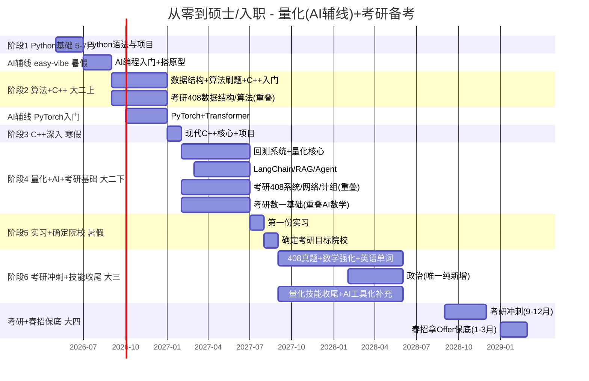

# 量化开发 + AI大模型 + 后端 + 考研 — 四轨主脉络

> 完整资源库(全轨道)见 `resources/lib/资源库.md` — 覆盖量化/AI/后端/考研/竞赛/求职
> 考研对照表见 `docs/plans/考研备考对照表.md`
> 各阶段细脉络见 `docs/plans/` 目录
>
> 核心原则: 技能学习 = 考研备考 (408约70%重叠, 数一约70-80%重叠)

---

## 发展路线


各轨道技能重叠程度:

| 轨道 | 与量化重叠 | 需要额外补充 |
|------|-----------|-------------|
| 量化开发 (主) | - | C++深度/金融基础/低延迟 |
| AI大模型 (保底) | ~60% | LangChain/RAG/PyTorch/微调 |
| 后端开发 (大保底) | ~70% | Go/分布式/Redis/K8s |
| AI+量化 (终极) | ~80% | ML因子/LLM另类数据/AI交易系统 |

> 参考: [AI-Trader](https://github.com/HKUDS/AI-Trader) (港大18k⭐) — Agent-Native交易平台, 阶段4-6研究.
>
> 策略: 以量化开发为主线, 技能天然覆盖AI和后端大部分要求.
> 每阶段学完都可随时切换轨道, 不需要从头开始.

> [!important] 2026-06-26 JD复核后的路线修正
> 新增多平台招聘采样显示: 高薪量化开发的硬门槛仍是 **C++/Linux/数据结构算法/多线程/网络/低延迟/交易系统端到端链路**。Python 是必要工具, AI 是加分和保底, 但不能压过 C++ 交易系统主线。因此阶段4从"量化60% + AI40%"调整为"量化系统75% + AI工具化25%".

---

> [!info] 完整资源库
> ⭐ 所有推荐的B站视频、GitHub项目、书籍、练习平台详见 `resources/lib/资源库.md`（按阶段分类，标注优先级）

> [!abstract] 背景档案 -> 详见 [[个人信息]]
> 本路线图基于 BOSS直聘/Liepin 等平台真实岗位要求编制.

---

## 一,岗位能力模型

### 市场真实需求(来自招聘网站)

| 技能项 | 出现频率 | 要求程度 | 对应学习阶段 |
|--------|---------|---------|------------|
| **C++** (11/14/17/20) | 极高 (90%+) | 核心语言,必须精通 | 阶段2-3 |
| **Python** (数据处理) | 极高 (90%+) | 辅助/原型语言,必须熟练 | 阶段1 |
| **数据结构与算法** | 高 (80%+) | 面试必考,工作中高频使用 | 阶段2 |
| **Linux系统** | 高 (80%+) | 开发环境,常用命令,Shell | 阶段3 |
| **网络编程** (TCP/UDP) | 中高 (60%+) | 交易系统通信基础 | 阶段4 |
| **多线程/多进程** | 高 (80%+) | 性能关键,高频交易核心 | 阶段4 |
| **数据库** (SQL) | 中 (50%+) | 数据存储/回测结果管理 | 阶段4 |
| **Git** | 高 (80%+) | 日常工作必备 | 阶段1 |
| **金融基础知识** | 中 (50%+) | 股票/期货/期权基础概念 | 阶段4 |
| **低延迟优化** | 中 (40%+) | 进阶技能,头部私募必备 | 阶段6 |
| **分布式系统** | 中 (40%+) | 大规模数据处理 | 阶段6 |
| **数据采集/ETL** | 中高 (60%+) | 实际工作日常,数据源接入清洗 | 阶段1/4 |
| **因子计算引擎** | 中 (40%+) | 有专门岗位方向,投研核心链路 | 阶段4/6 |
| **交易系统端到端** | 高 (70%+核心JD) | 行情接入/订单状态/风控/监控/对账 | 阶段4-6 |
| **性能排障** | 中高 (60%+) | GDB/perf/日志/压测/故障复盘 | 阶段3-4 |
| **PyTorch/深度学习** | 新增(部分JD) | ML因子/信号生成,AI量化交叉 | 阶段2-4 |
| **LangChain/RAG/Agent** | 新增(加分/保底) | 量化资料助手/AI应用开发保底 | 阶段4 |
| **大模型API/微调** | 新增(加分项) | 另类数据/AI应用兜底,不抢主线时间 | 阶段4-5 |

> [!info] 学历门槛
> 量化开发 >80% 岗位要求本科及以上,对学历要求明显低于量化研究员(后者通常要求硕士起步).这是数据科学专业本科生**最现实的切入点**.

### 面试流程

```
简历筛选 -> 在线笔试(算法题) -> 技术一面(C++/Python) -> 技术二面(系统设计) -> HR面 -> Offer
```

核心考察点:
1. **编程能力**(手写代码,LeetCode Medium/Hard)
2. **C++深度**(内存管理,模板,性能优化)
3. **系统设计**(如何设计一个回测系统,订单管理系统)
4. **项目经验**(GitHub 上的个人项目,实习项目)

---

## 二,招聘市场真实画像

> 以下基于 BOSS直聘 + 猎聘 上海/北京/深圳三地2026年5月实时招聘数据整理.完整数据见 [[招聘市场调研报告]].

### 岗位供需特点

| 维度 | 发现 |
|------|------|
| 应届机会 | 百亿级私募(如某中型百亿对冲基金)也招应届生,30-60K |
| 实习转正 | 80%的实习岗位标注"留用机会",实习是入职核心通道 |
| C++溢价 | C++强的实习生日薪可达2000-3000元,普通实习生100-400元 |
| 学历门槛 | "本科及以上"是主流,硕士非必须,但你得有硬技能 |
| 城市集中 | 上海(浦东/虹口)> 北京 > 深圳,上海量化私募密度最高 |

### 岗位实际工作内容(来自真实JD)

| 模块 | 日常占比 | 对应技能 | 学习阶段 |
|------|---------|---------|---------|
| 数据采集与清洗 | ~30% | Python/Pandas | 阶段1 |
| 回测系统开发 | ~25% | C++核心 | 阶段4 |
| 因子计算引擎 | ~20% | C++/Python | 阶段4 |
| 交易信号生成 | ~15% | C++多线程/网络 | 阶段6 |
| 执行监控与运维 | ~10% | 低延迟/Linux | 阶段6 |

### 实习生薪资真相(决定方向的关键数据)

| 方向 | 日薪 | 月薪(20天) | 年化 |
|------|------|------------|------|
| Python数据处理 | 100-400元 | 2K-8K | 3-12万 |
| C++系统开发 | 2000-3000元 | 40K-60K | 48-72万 |
| **差距倍数** | **5-10倍** | **5-10倍** | **5-10倍** |

> **一句话:C++能力决定薪资天花板.同样的实习,C++强的人日薪是普通人的5-10倍.**

### 猎聘全国数据补充(全国范围,经验不限~5年)

| 岗位 | 城市 | 薪资 | 说明 |
|------|------|------|------|
| 量化开发工程师 | 北京 | 30-50K·15薪 ~ 35-60K·18薪 | 本科经验不限 |
| 量化开发C++ | 北上深 | 60-90K·24薪 | 本科经验不限 |
| 高频量化开发 | 上海 | 60-80K·18薪 | 3-5年经验 |
| 量化开发(期权期货方向) | 上海/北京 | 45-75K·15薪 | 3年以上 |
| 量化开发(基础设施&后端) | 上海 | 55-80K·16薪 | 5-10年 |
| 外资Quant Developer | 上海 | 70-100K·18薪 | 3-5年 |

> 猎聘数据说明: 北京量化岗位密度仅次于上海,全国范围量化开发薪资区间 30-90K,随经验增长空间显著.

### 专项方向需求分析(来自招聘JD细分)

| 方向 | 代表公司 | 薪资参考 | 特点 |
|------|---------|---------|------|
| 因子计算引擎 | 量魁私募 | 200-500元/天(实习) | 投研核心链路,需C++/Python |
| 期权期货方向 | 多家公司 | 45-75K·15薪 | 衍生品知识要求 |
| 基础设施/后端 | 多家量化 | 55-80K·16薪 | 偏工程,适合开发背景 |
| 高频交易 | 多家公司 | 60-80K·18薪 | 低延迟核心,要求最高 |

### 竞品分析:你的对手是谁？

| 竞争者类型        | 你的优势             | 你的劣势     |
| ------------ | ---------------- | -------- |
| 985/211计算机科班 | 数学/统计基础更好,贴近量化业务 | 开发深度可能不如 |
| 金融工程/金融数学硕士  | 代码能力强,薪资期望低      | 学历不如     |
| 有经验的社招人员     | 应届薪资低,可塑性强       | 缺实战经验    |

**结论:** 量化开发岗比的是代码能力,学历权重低.数据科学专业做量化开发是典型的"蓝海切入".

---

## 三,目标就业画像

### 毕业时的硬性量化指标

| 指标 | 目标值 | 说明 |
|------|-------|------|
| GPA | ≥ 3.5 / 4.0 | 保持中上,简历不拖后腿 |
| LeetCode | 500题 (250M + 100H) | 面试手撕代码不虚 |
| GitHub | 5+ 项目,持续活跃 | 证明代码能力,面试直接展示 |
| 实习 | 2段 (大二+大三) | 实习转正是核心通道 |
| 竞赛 | 2+ 奖项 | 数模国赛+美赛+量化比赛 |
| C++项目 | 3+ 独立项目 | 回测引擎+订单系统+交易引擎 |

### 大四毕业时你的简历应该长这样

```
【教育】
中国地质大学(武汉)- 数据科学与大数据技术 - 本科 - GPA 3.5+

【编程语言】
- C++:精通现代C++(11/14/17/20),STL,内存管理,多线程,低延迟优化
- Python:熟练NumPy/Pandas数据处理,能快速开发原型和数据管道

【项目经验】
- 股票回测系统:支持多因子回测,绩效分析(C++实现,GitHub ⭐)
- 订单管理模拟系统:订单簿维护,撮合逻辑,风控检查(C++实现)
- 多因子分析框架:因子计算,IC/IR分析,分层回测(Python实现)
- 个人GitHub:持续活跃,项目有文档有测试

【竞赛】
- 数学建模国赛(省级二等奖)
- 美国大学生数学建模竞赛(H奖)
- WorldQuant Challenge 参赛经验

【实习】
- 量化私募 量化开发实习(一段或两段)
```

---

## 四,大时间线



---

### 4.1 阶段详细规划

### 4.0 学习量安排原则

> 每天的学习量不能凭感觉安排。先按阶段终点倒推容量,再拆到 day / week。详细规则见 `docs/plans/学习量校准规则.md`。
> 每道练习也不能凭感觉出题。必做题只能用已教技术,详细规则见 `docs/plans/练习依赖校准规则.md`。

| 层级 | 必须先确定 | 再安排什么 |
|------|------------|------------|
| 阶段 | 阶段终点、岗位权重、总可用时间、缓冲比例 | 阶段内主线/项目/复习比例 |
| 周 | 本周服务哪个阶段产出、前置依赖是否稳定 | 4-6个学习 day + 1个复盘/缓冲 day |
| 日 | 当天唯一主目标、时间预算、练习数量、验收产出 | 复习/讲解/练习/综合/复盘 |

默认容量:

| Day 类型 | 合理容量 | 超量处理 |
|----------|----------|----------|
| 普通技能课 | 2.5-3h | 拆掉低权重知识点 |
| 项目课 | 3-4h | 控制在一个可运行模块 |
| 综合测试/复习课 | 2-4h | 只测已学内容,不塞新知识 |

硬规则: 如果一天同时引入新库、新数据源、新项目结构,或练习超过10道还带大综合,必须拆天或降为选做。

### 阶段1:Python基础 -> 任务驱动入门(5月-7月,5周)

> [!tip] 岗位对应:Python数据处理能力,Git,第一个项目 + AI工具链入门
>
> 调研更新(2026-05-31): 当前竞争环境下Python可压缩到5周,更早进入C++阶段.
> AI编码工具(Cursor/Claude Code)从阶段1起作为日常工具使用,不是"额外学习".

| 周 | 内容 | 产出 |
|----|------|------|
| 1-2 | Python语法基础(变量/控制流/函数/数据结构) | 小脚本 |
| 3 | NumPy/Pandas + 正则/JSON + Git基础 | 数据处理能力 |
| 4 | Matplotlib可视化 + **数据采集与清洗** | 数据处理能力 |
| 5 | 综合项目:股票分析工具 + Git实践 | GitHub项目 |

**目标:** GitHub有1-2个质量过关的小项目,能独立处理数据分析任务,掌握基础数据采集能力

**📚 推荐资源:**
- ⭐ **完整资源库见** `resources/lib/资源库.md`（按阶段分类，标注优先级）
- 快速入门:[林粒粒呀《3小时超快速入门Python》](https://b23.tv/BV1Jgf6YvE8e)(616万播放,2026新版)
- 系统参考:【全748集】Python零基础教程 [BV1rpWjevEip](https://b23.tv/BV1rpWjevEip)(1658万播放)
- 备选参考:[黑马程序员Python教程](https://b23.tv/BV1qW4y1a7fU)(2438万播放)
- 官方文档:[Python Tutorial](https://docs.python.org/3/tutorial/)(权威语法参考)
- 练习项目:[Python-100-Days](https://github.com/jackfrued/Python-100-Days)(⭐182k)
- 🐳 量化出课参考:[whale-quant ch03 股票数据获取](https://github.com/datawhalechina/whale-quant)(Day 09-13数据采集/清洗参考) [`resources/lib/whale-quant学习路线参考.md`]
- 🧩 项目拆解参考:[daily_stock_analysis](https://github.com/ZhuLinsen/daily_stock_analysis)(阶段1只参考数据源降级/报告结构, 阶段4后再研究完整AI+量化系统)

> 📌 本阶段日常使用 Claude Code/Cursor 作为辅助工具,熟悉AI编码的能力边界.

---

### 阶段2:数据结构与算法 + C++入门(大二上 9-1月)

> [!tip] 岗位对应:面试手撕代码,C++基础

**内容:**
- 数据结构:数组/链表/栈/队列/树/图/哈希表/堆
- 算法:排序/搜索/动态规划/贪心/回溯
- 刷题计划:LeetCode 100题(50 easy + 40 medium + 10 hard)
- C++入门:语法,STL,面向对象（已通过 `projects/cpp/cpp_test.cpp` 摸底，用户C++接触过OOP/模板，可跳过基础语法直接进入数据结构阶段）

**目标:** LeetCode 100题,能写C++程序

**📚 推荐资源:**
- ⭐ **完整资源库见** `resources/lib/资源库.md`
- 算法天花板:[左程云《一周刷爆LeetCode》](https://b23.tv/BV13g41157hK)(315万播放,从基础到高级全覆盖)
- DP/贪心专题:[灵茶山艾府](https://space.bilibili.com/206214)(B站最好的DP入门)
- 数据结构动画:[mycodeschool中文配音](https://b23.tv/BV1eMcZe2Ejc)(直观好懂)
- 刷题攻略:[代码随想录](https://github.com/youngyangyang04/leetcode-master)(按专题组织,效率高5倍)
- 框架思维:[labuladong算法小抄](https://github.com/labuladong/fucking-algorithm)(把算法题归类为套路)
- C++入门:[黑马程序员C++教程从0到1](https://b23.tv/BV1et411b73Z)(4600万播放,B站最高)
- C++进阶:[Cherno C++ Series](https://www.youtube.com/playlist?list=PLlrATfBNZ98dudnM48yfGUldqGD0S4FFb)(国外最受好评,覆盖现代C++特性)
- C++面试:[huihut/interview](https://github.com/huihut/interview)(30k+ ⭐,C++八股文)

---

### 阶段3:C++深入(寒假 1-2月)

> [!tip] 岗位对应:C++是量化开发第一语言,必须过硬

**内容:**
- 现代C++:智能指针,lambda,移动语义,右值引用
- 内存管理:栈/堆,RAII,内存池
- STL源码理解
- 小项目:高性能计算工具

**目标:** 独立写C++项目,理解内存模型

**📚 推荐资源:**
- 系统教程:[黑马程序员C++教程从0到1](https://b23.tv/BV1et411b73Z)(4600万播放,完整配套视频)
- 现代C++专题:[Cherno C++ Series](https://www.youtube.com/playlist?list=PLlrATfBNZ98dudnM48yfGUldqGD0S4FFb)(智能指针/移动语义时必看)
- 多线程专题:[爱编程的大丙](https://b23.tv/BV1sv41177e4)(讲解清晰,覆盖面广)
- 必读书:《C++ Primer》(入门圣经)->《Effective Modern C++》(最佳实践)->《STL源码剖析》(底层理解)
- GitHub参考:[C++那些事](https://github.com/Light-City/CPlusPlusThings)(学习指南+面试总结)
- 面试八股:[C++面试八股文](https://github.com/huihut/interview)(常见面试题整理)

---

### 阶段4:量化系统主线(75%) + AI工具化辅线(25%) — 大二下 2-7月

> [!tip] 岗位对应(量化):Linux/多线程/网络/数据库/金融基础/因子计算/交易系统端到端链路
> 岗位对应(AI): AI编码工具/PyTorch基础/RAG量化资料助手/Agent工具调用
>
> 2026-06-26 JD复核后调整: 阶段4不再做"AI双主线". 先把交易系统链路打穿, AI只做工具化加分和保底.

**量化系统主线(75%):**
- Linux开发环境 + Shell脚本
- GDB/perf/日志/简单压测,能解释性能问题
- 多线程编程(C++ thread,同步,锁)
- 网络编程基础(socket,TCP/UDP)
- SQL数据库
- 金融基础(股票/期货/期权,交易规则,**市场微观结构**,订单簿,撮合,滑点)
- 因子计算入门(因子定义,IC分析,分层回测)
- **核心项目1:** C++事件驱动回测引擎
- **核心项目2:** 简易交易链路模拟器(行情接入→信号→下单→订单状态→风控→成交回报→监控日志)

**AI工具化辅线(25%):**
- **AI编码工具**: 用 Claude Code/Cursor 做代码解释、测试生成、性能排查辅助
- **PyTorch基础**: 张量/自动求导/简单因子模型,只服务量化实验
- **RAG最小项目**: 量化JD/研报/项目文档问答助手,作为保底展示项
- **Agent工具调用**: 封装行情查询/回测运行/报告生成工具
- **暂缓:** LLM微调、复杂Agent、多模型部署,移到阶段5-6有余力再做

**AI+量化交叉(可选):**
- 深度学习因子挖掘(用PyTorch做因子)
- LLM做另类数据分析(财报/新闻情感分析)
- ML在回测中的应用(过拟合检测,特征选择)

**目标:** LeetCode 250题,量化方向可投大二实习;简历能讲清一个回测系统和一个交易系统端到端链路;考研408系统/网络/计组基础打牢

**目标(量化):** LeetCode 250题, 可投大二暑期实习, GitHub有回测引擎+交易链路模拟器
**目标(AI):** 完成一个轻量RAG/Agent工具化项目,不挤占C++主线
**目标(考研):** 408(OS/网络/计组)过一轮,数学一基础过完(与AI数学重叠)

**📚 量化资源:**
- ⭐ **完整资源库见** `resources/lib/资源库.md`
- Linux网络:[黑马程序员Linux网络编程](https://b23.tv/BV1iJ411S7UA)(66.8万播放)
- Linux多线程:[码农论坛Linux多线程详解](https://b23.tv/BV1zf4y1Q7Nj)
- 网络+多线程结合:[爱编程的大丙并发网络通信](https://b23.tv/BV1F64y1U7A2)
- 网络编程进阶:[陈硕Linux C++网络编程实践](https://b23.tv/BV1mm42177mk)
- SQL入门:[SQLBolt](https://sqlbolt.com/)(交互式教程)
- 量化入门:[量化交易零基础入门108集](https://b23.tv/BV1bXCTBGE42)
- VNPY入门:[15天入门量化交易](https://b23.tv/BV1To4y1k7p1)
- 量化整体认知:[邢不行量化投资学习路线一条龙](https://b23.tv/BV1EhkwYUEyt)
- 金融必读书:《打开量化投资的黑箱》→《交易系统与方法》→《期权,期货及其他衍生产品》
- 开源项目研究:[vnpy/vnpy](https://github.com/vnpy/vnpy)(41k⭐) → [QuantConnect/Lean](https://github.com/QuantConnect/Lean)(19k⭐) → [backtrader](https://github.com/mementum/backtrader)(21k⭐)
- 🐳 whale-quant出课参考:[whale-quant ch04-ch07](https://github.com/datawhalechina/whale-quant)

**📚 AI资源(新增):**
- ⭐ Datawhale教程体系(全部开源免费):
  - [LLM Cookbook](https://github.com/datawhalechina/llm-cookbook)(15.8k⭐) — RAG+Agent实战,阶段4主力教程
  - [Happy-LLM](https://github.com/datawhalechina/happy-llm)(10.8k⭐) — Transformer原理→LoRA微调,阶段3-4
  - [LLM-Universe](https://github.com/datawhalechina/llm-universe)(6.8k⭐) — 知识库助手项目实战
  - [Tiny-Universe](https://github.com/datawhalechina/tiny-universe) — 手写Transformer/RAG/Agent(极简代码)
  - [easy-vibe](https://github.com/datawhalechina/easy-vibe)(15.8k⭐) — AI编程入门,阶段1平行
  - 🆕 [ai-engineering-from-scratch](https://github.com/rohitg00/ai-engineering-from-scratch)(31k⭐) — AI/ML完整课程,一课一项目,克隆到本地
- 🆕 [obra/superpowers](https://github.com/obra/superpowers)(224k⭐) — Agent技能框架,研究其skills架构思路
- LLM原理理解:[The Illustrated Transformer](https://jalammar.github.io/illustrated-transformer/)
- 微调框架:[LLaMA-Factory](https://github.com/hiyouga/LLaMA-Factory)(35k⭐)
- LangChain官方文档:[python.langchain.com](https://python.langchain.com/)
- 零基础路线:[Zero to AI](https://github.com/PavanMudigonda/zero-to-ai)(950+ Jupyter Notebook)

---

### 阶段5:第一份实习(大二暑假 7-8月)

> [!tip] 目标公司:小私募 / FinTech公司 / 券商IT,薪资参考100-400元/天

**实习前(4-6月):**
- 完善GitHub,确保项目有README和使用说明
- LeetCode刷到200题(120 Easy + 70 Medium + 10 Hard)
- 准备C++八股文(智能指针,虚函数,内存布局)
- 制作一页纸简历,找学长/老师修改
- BOSS直聘+猎聘海投,每天3-5家

**实习中(7-8月):**
- 每天写工作日志(记录学到的东西)
- 主动要任务,别等着被分配
- 跟同事学代码规范,工程实践,Git工作流
- 了解量化业务全流程(数据->研究->回测->交易)
- 争取留下好印象,为以后要推荐信

**产出:**
- 一段真实量化开发经历(简历核心卖点)
- 实习证明 + 可留用的推荐信
- 明确大三方向(继续冲量化 or 转互联网保底)

---

### 阶段6:冲刺 + 秋招(大三 9月-大四6月)

> [!tip] 岗位对应:全部技能汇总,达到入职水平

**技术冲刺(9-12月):**
- C++进阶:低延迟优化,内存对齐,缓存友好设计,SIMD指令
- 分布式系统基础:ZeroMQ/消息队列,通讯协议,序列化
- 交易系统架构:订单管理,风控模块,行情接入,信号生成
- **核心项目:** 用C++实现简易交易引擎(订单簿+撮合+风控)

**面试准备(1-4月):**
- LeetCode 500题(200 Medium + 100 Hard,反复刷)
- C++八股系统复习(结合项目经验讲)
- 系统设计题专项(设计回测系统 -> 设计订单系统 -> 设计交易引擎)
- 模拟面试(找学长/付费模拟/录音复盘)

**投递策略(2-6月):**
- 2月:投递暑期实习(量化私募 + 互联网后端双线)
- 3-4月:集中面试,每周至少3场
- 5-6月:确定暑期实习offer
- 7-8月:暑期实习(目标转正)
- 9月起:秋招正式批,拿offer

**目标:** 拿到年薪30w+的量化开发offer,或25w+的AI应用开发offer(保底)

**📚 推荐资源:**
- ⭐ **完整资源库见** `resources/lib/资源库.md`
- 岗位认知:[C++主流高薪岗位分析 - 量化交易开发](https://b23.tv/BV1vGCKBDEfM)(了解真实工作内容)
- 开源架构参考:**muduo**(陈硕Reactor模式)-> **vnpy**(国内开源量化系统)-> **Lean**(QuantConnect架构)
- C++面试:[huihut/interview](https://github.com/huihut/interview)(30k+⭐八股文)
- 性能分析工具:perf(阶段6学习),Valgrind(内存检测,阶段3开始用)
- 面试准备:复习阶段1-4所有资源 + 刷LeetCode 500题 + 系统设计专项
- 信息源:BOSS直聘(岗位需求变化),知乎"量化"话题(面经),一亩三分地(量化面经)

---

### 4.2 里程碑倒推表(从大四倒推)

| 时间 | 必须完成的事 |
|------|------------|
| 大三暑假 (2028.7) | 🏢 暑期实习(转正通道) |
| 大三下学期 (2028.2-6) | 📮 海投暑期实习,持续面试 |
| 大三上学期 (2027.9-2028.1) | LeetCode 350题,系统设计准备 |
| 大二暑假 (2027.7-8) | 🏢 **第一份实习** |
| 大二下学期 (2027.2-6) | 📮 投递大二实习,继续刷题 |
| 大二上学期 (2026.9-2027.1) | LeetCode 100题,C++入门 |
| **现在 (2026.5)** | **Python入门,GitHub建仓** |

---

### 4.3 实战触发点:什么时候刷题、上平台、做项目、参赛、投实习

> 这张表是行动闸门。到点就下场,没到点别硬冲; 尤其不要在还不懂回测指标时沉迷平台收益曲线。

| 时间/阶段 | 能力阈值 | 可以开始做什么 | 目标产出 | 风险提示 |
|----------|----------|----------------|----------|----------|
| Day 08-10后 | 会NumPy/Pandas,能算收益率/均线/波动率 | 开始做小型数据分析题,看聚宽/米筐新手文档 | 1篇股票数据分析笔记 | 只看平台教程不写代码=无效学习 |
| Day 14后 | 会采集、清洗、信号、简单回测指标 | 第一次使用聚宽/米筐做双均线/动量策略回测 | 平台回测截图 + 本地Pandas复现对照 | 平台封装太多,必须本地复现一遍 |
| Day 16后 | 有股票分析工具v2,README和最小测试 | 报名/准备数学建模国赛,做一个阶段1项目仓库 | GitHub项目 + 国赛准备模板 | 这时还不适合投量化开发实习 |
| 阶段2 Week 3后 | C++基础+STL入门 | 正式开始LeetCode,所有题优先C++ | C++算法题解仓库启动 | 过早刷会卡在语法,前2周先迁移思维 |
| 阶段2 Week 8后 | 数组/链表/栈队列/树基础 | 做交易系统数据结构小练习 | 环形缓冲区/订单队列/简易订单簿 | 这是项目雏形,不是简历核心项目 |
| 阶段2结束 | LeetCode 100题,C++能独立写程序 | 做美赛/量化平台因子练习入门 | 美赛参与/平台因子笔记 | 目标是练建模和表达,不是立刻赚钱 |
| 阶段3结束 | 现代C++/内存/性能工具入门 | 做C++高性能计算工具和内存池 | 2个C++项目仓库 | 代码要有benchmark,否则说服力弱 |
| 阶段4 Week 8后 | Linux+多线程+socket初步 | 做本地行情接收器,继续LeetCode到200题 | TCP行情demo + 日志/延迟统计 | 这时可以开始注册招聘平台看JD |
| 阶段4 Week 17后 | C++回测引擎v1成型 | 开始投小私募/FinTech/券商IT实习 | 简历v1 + 每周投递清单 | 没项目不要海投,会浪费第一印象 |
| 阶段4结束 | 回测引擎+交易链路模拟器+LeetCode 250题 | 正式冲大二暑期实习,参加WorldQuant BRAIN/IQC类比赛 | 第一份实习或比赛记录 | 平台比赛偏研究,实习偏工程,别混淆 |
| 阶段6 | 交易引擎+低延迟优化+LeetCode 500题 | 冲头部量化/暑期转正/秋招 | 可讲30分钟的项目集 | 头部岗看系统深度和面试硬功夫 |

**量化平台使用顺序:**
1. **本地Pandas/Baostock**: Day 09-14主线,先理解数据和指标。
2. **聚宽 JoinQuant**: Day 14后第一次上手,用于快速体验策略回测和模拟交易流程。官方新手指南说明平台支持Python在线编辑、设置回测参数、快速/完整回测和模拟交易。
3. **米筐 Ricequant/RQAlpha**: 阶段1项目后到阶段4使用,重点学习事件驱动回测框架; 官方文档说明RQAlphaPlus把量化交易抽象成响应行情、发出交易信号,并自动处理风控、撮合、账户等流程。
4. **WorldQuant BRAIN**: 阶段4前后使用,适合因子/Alpha竞赛; 2026 IQC官方说明比赛通过BRAIN平台构建并提交alpha,表现好有奖金、研究顾问、实习或全职机会。
5. **天池/Kaggle金融类比赛**: 阶段1后可做金融风控/数据算法入门,阶段4后再做量化策略类或ML因子类。

---

## 五,实习策略专项

> 招聘数据显示:**实习转正是量化开发最核心的入职通道**.几乎所有实习岗位都标注"实习留用机会".

### 5.1 两段实习时间线

| 时段 | 目标 | 公司层级 | 薪资参考 |
|------|------|---------|---------|
| 大二暑假 (2027.7-8) | 第一份实习练手 | 小私募 / FinTech / 券商IT | 100-400元/天 |
| 大三暑假 (2028.7-8) | 暑期实习转正 | 启林/顽岩/宽德等知名量化 | 2000-3000元/天 |

### 5.2 目标公司分层投递

| 层级 | 公司 | 投递时间 | 策略 |
|------|------|---------|------|
| 🌟 梦想 | 九坤,幻方 | 大三秋招 | 需要ACM/竞赛加持 |
| 🌟 主攻 | 启林,衍复,宽德,顽岩 | 大二下+大三 | 实习转正,最现实 |
| 🌟 保实习 | 爱凡哲,组优科技,天宝智算 | 大二下 | 经验不限本科 |
| 🌟 兜底 | FinTech / 券商IT | 随时 | 积累开发经验 |

### 5.3 投递日历

| 时间 | 动作 | 准备工作 |
|------|------|---------|
| 大二上 (2026.12) | 注册BOSS直聘+猎聘,完善在线简历 | 阶段1-2完成,GitHub有项目 |
| 大二寒假 (2027.1-2) | 制作简历,找人修改 | 阶段3完成(C++深入) |
| 大二下 (2027.2) | 开始海投,每天投3-5家 | 阶段4启动,有回测项目 |
| 大二下4月 | 集中面试,争取暑假实习 | LeetCode 200题+ |
| 大二暑假前 (2027.6) | 确定实习offer | - |
| 大三上 (2027.9) | 继续投大三暑期实习 | LeetCode 350题+ |
| 大三下 (2028.2-6) | 冲刺暑期实习面试 | LeetCode 500题+ |

### 5.4 面试准备清单

```
□ 算法:LeetCode Medium熟练,Hard能解
□ C++八股:智能指针,虚函数,内存布局,STL源码
□ 系统设计:回测系统架构,订单管理系统,低延迟要点
□ 项目深挖:简历上每个项目都能讲30分钟
□ 金融基础:股票/期货交易规则,订单簿,撮合机制
□ 行为面试:为什么量化？为什么开发不是研究？
```

---

## 六,目标公司与岗位要求

### 第一梯队｜九坤投资 (Ubiquant)

| 项目 | 要求 |
|------|------|
| 岗位 | C++开发工程师(量化实现方向),行情系统开发,量化实现工程师,策略组合管理开发,k8s集群开发 |
| 语言 | 精通C++,熟悉Python |
| 核心 | 数据结构,算法,网络,操作系统,k8s |
| 地点 | 北京/上海 |
| 招聘渠道 | BOSS直聘/猎聘/官网校招(牛客网同步) |
| 薪资参考 | 40-80w(应届) |
| 实际数据 | 行情系统开发专家 70-100k·16薪,量化开发 30-60k |
| 官网 | https://www.ubiquant.com (招贤纳士页面) |
| 概述 | 2012年成立,国内顶级量化对冲基金,海内外顶尖高校背景,超大规模算力集群 |

### 第一梯队｜幻方量化 (High-Flyer)

| 项目 | 要求 |
|------|------|
| 岗位 | 核心系统研发工程师(AGI),深度学习研发工程师,深度学习科学家,DeepSeek全栈开发 |
| 语言 | C++为主,Python为辅 |
| 核心 | 高性能计算,低延迟,AGI基础设施,大模型训练推理优化 |
| 地点 | 北京/杭州 |
| 招聘渠道 | BOSS直聘/猎聘/官网校招 |
| 薪资参考 | 40-100w(应届) |
| 实际数据 | DeepSeek全栈 35-65k·14薪,招聘经理 20-50k·14薪 |
| 官网 | https://www.high-flyer.cn (加入我们) |
| 概述 | AI对冲基金,开发岗位围绕AGI基础设施/大模型训练推理优化/量化交易系统,团队80%+硕博 |

### 第一梯队｜衍复投资

| 项目 | 要求 |
|------|------|
| 岗位 | 量化开发工程师 |
| 语言 | C++,Python |
| 核心 | 数据结构,算法,多线程,网络 |
| 学历 | 本科及以上 |
| 薪资参考 | 30-60w(应届) |

### 第二梯队｜启林投资(百亿量化,应届最友好)

| 项目 | 要求 |
|------|------|
| 岗位 | 量化开发工程师 Quant Developer,AI量化研究员(深度学习),基础设施开发,开发工程师(校招),量化研究实习生(可转正) |
| 语言 | C++,Python |
| 核心 | 数据结构与算法,系统设计,AI驱动量化 |
| 学历 | 本科及以上,经验不限 |
| 薪资参考 | 40-50w(应届) |
| 实际数据 | BOSS直聘19个活跃岗位,量化开发约46.7K(职友集),基础设施25-45K,量化开发(Python)20-45K(牛客网) |
| 概述 | 2015年成立,百亿规模(管理规模300亿),聚焦AI驱动量化,团队百余人,上海虹口 |

### 第二梯队｜宽德投资 (WizardQuant)

| 项目 | 要求 |
|------|------|
| 岗位 | 量化交易系统开发工程师,WILL智能学习实验室AI人才 |
| 语言 | C++,Python |
| 核心 | 数据结构与算法,系统设计,AI |
| 学历 | 本科及以上 |
| 招聘渠道 | BOSS直聘/官网 |
| 薪资参考 | 25-50w(应届) |
| 实际数据 | 170亿管理规模,2025年成立WILL智能学习实验室(独立孵化,布局通用性超级助手) |
| 官网 | https://www.wizardquant.com |
| 概述 | 2014年成立,低调实干型量化私募,上海/北京/珠海 |

### 第二梯队｜顽岩资产 / 磐松资产 / 太衍私募

| 项目 | 要求 |
|------|------|
| 特征 | 均在BOSS直聘有实习/应届岗位,实习留用机会明确 |
| 语言 | C++/Python |
| 实习薪资 | 200-400元/天(普通),2000-3000元/天(C++方向) |
| 转正薪资 | 30-60K-20-24薪 |
| 策略 | **建议重点投递,实习转正是最佳入职通道** |

### 第三梯队｜实习友好公司(应届/实习直投)

| 公司 | 岗位 | 薪资(应届) | 特点 |
|------|------|------------|------|
| 爱凡哲投资管理 | 量化开发工程师(QD) | 30-50K-13薪 | 应届本科可投 |
| 上海组优科技 | 量化开发-软件架构 | 23-30K | 校招本科 |
| 上海天宝智算 | 量化交易开发 | 23-40K | 经验不限本科 |
| 上海江航孔信息 | 量化工程师 | 23-30K | 经验不限本科 |
| 宁苑资产 | 量化策略实习 | 50-80K(实习) | 应届本科 |
| 卡方科技 | 量化研究员(实习) | 50-80K-25薪 | 实习可转正 |
| 微观博易 | 量化交易实习生 | 2000-3000元/天 | 实习 |
| 鸣石投资 | 量化开发实习生 | 200-400元/天 | 实习留用 |
| 磐松资产 | 量化开发实习生(软件架构) | 300-400元/天 | 实习 |

### 保底｜互联网后端 / FinTech

| 项目 | 要求 |
|------|------|
| 岗位 | 后端开发工程师 |
| 语言 | C++/Go/Java |
| 核心 | 数据结构,数据库,分布式 |
| 薪资参考 | 20-35w(应届) |
| 说明 | **互切策略:** 大二没找到量化实习就先做互联网后端,大三再冲一次量化 |

---

## 七,技能树总图

```mermaid
graph TD
    subgraph 编程基础
        Python --> 数据处理
        Python --> 数据采集
        Python --> 算法原型
        Cpp[C++ Modern] --> 交易系统
        Cpp --> 回测引擎
        Cpp --> 低延迟
        Cpp --> 因子引擎
    end

    subgraph 计算机基础
        DS[数据结构] --> 算法
        OS[操作系统] --> 多线程
        OS --> 内存管理
        Net[网络] --> TCP
        Net --> Socket编程
    end
    
    subgraph 量化系统主线(75%)
        Linux --> 开发环境
        Linux --> 性能排障
        SQL --> 数据存储
        Finance[金融基础] --> Market[市场微观结构]
        Market --> 订单簿
        Market --> 撮合机制
        Backtest[回测系统] --> Strategy[策略实现]
        Trade[交易链路] --> 行情接入
        Trade --> 订单状态机
        Trade --> 风控监控
        因子引擎 --> IC分析
        因子引擎 --> 分层回测
    end

    subgraph AI工具化辅线(25%)
        PyTorch --> DL[深度学习]
        DL --> ML因子[简单ML因子]
        LLM[大模型应用] --> RAG助手
        LLM --> Agent工具调用
        LLM --> AI编码提效
        深度学习 --> ML因子[AI+量化交叉]
        LLM --> 另类数据[LLM另类数据分析]
    end

    subgraph 面试
        算法刷题 --> Offer
        Cpp深度 --> Offer
        系统设计 --> Offer
        项目经验 --> Offer
        实习经历 --> Offer
        AI项目 --> Offer
    end
```

---

## 八,竞赛与开源策略

> 竞赛获奖和GitHub活跃度是简历重要加分项,尤其在没有实习经历之前,它们是证明你能力的关键证据.

### 8.1 竞赛时间线

| 时间 | 竞赛 | 前提准备 | 目标 |
|------|------|---------|------|
| 2026.9 | 数学建模国赛 | Python数据处理完成(阶段1) | 省二以上 |
| 2027.2 | 美赛 MCM/ICM | Python数据分析+论文写作 | H奖以上 |
| 2027.6 | WorldQuant Challenge | Python+因子研究基础 | 积累量化经验 |
| 2027.9 | 数学建模国赛(二刷) | 更多编程经验 | 省一/国奖 |
| 持续 | Kaggle / 天池量化比赛 | 随时关注 | 丰富简历 |

### 8.2 GitHub 运营策略

| 阶段 | 目标 | 具体动作 |
|------|------|---------|
| 阶段1 | 1-2个仓库 | Python股票分析工具为主, README清楚, 可复现, 不堆AI/Web大项目 |
| 阶段2 | 5个仓库 | 算法题解仓库(C++实现)+PyTorch练手,每天小commit |
| 阶段3 | 持续提交 | C++项目上传,保持GitHub绿化 |
| 阶段4 | ⭐ 2个核心项目上线 | 回测引擎(C++)+交易链路模拟器(C++),另做轻量RAG/Agent工具,写详细文档 |
| 阶段5-6 | 积累stars | 在知乎/技术社区分享项目文章,两方向各1篇 |

### 8.3 技术博客(加分项,非必须)

推荐在 知乎/掘金 写量化开发学习笔记,标题参考:
- 《从零写一个回测引擎》
- 《C++智能指针在量化系统里的应用》
- 《本科量化开发学习路线图——从地大到量化私募》

---

## 九,时间节点倒推(从大四倒推)

| 时间 | 必须完成的事 |
|------|------------|
| 大三暑假 (2028.7) | 🏢 暑期实习(转正通道) |
| 大三下学期 (2028.2-6) | 📮 海投暑期实习,持续面试 |
| 大三上学期 (2027.9-2028.1) | LeetCode 350题,系统设计准备 |
| 大二暑假 (2027.7-8) | 🏢 **第一份实习** |
| 大二下学期 (2027.2-6) | 📮 投递大二实习,继续刷题 |
| 大二上学期 (2026.9-2027.1) | LeetCode 100题,C++入门 |
| **现在 (2026.5)** | **Python入门,GitHub建仓** |

---

## 十,保底路线

> 量化岗位竞争激烈,建议同时准备保底方向.

**AI应用开发(推荐保底):**
- 重合技能:Python,数据结构与算法,Linux,数据库
- 需要补充:LangChain,RAG,Agent开发,PyTorch,模型微调
- 目标公司:互联网大厂AI部门,AI创业公司,金融科技
- 2025年AI岗位同比增长543%,7.2万个岗位,覆盖全行业

**互联网后端开发(次选保底):**
- 重合技能:数据结构与算法,C++/Python,操作系统,网络,数据库
- 需要补充:Go语言,分布式系统理论,微服务架构
- 目标公司:美团,字节,腾讯,阿里等

**互切策略:**
1. 大二暑假如果能找到量化实习 -> 继续量化路线
2. 如果找不到量化实习 -> 大二暑假先做AI应用开发实习(岗位多,入门快)
3. 大三再冲一次量化,两不耽误

---

## 十一,学习资源快速参考

> 以下为量化开发方向核心书籍汇总,来自百度搜索+招聘调研整理,按学习路径分层.详见 `resources/教学资源参考.md`.

### 入门奠基

| 书名 | 作者 | 适合阶段 | 说明 |
|------|------|---------|------|
| 《C++ Primer》 | Lippman | 阶段2-3 | C++入门圣经 |
| 《Effective C++》 | Scott Meyers | 阶段3 | C++最佳实践 |
| 《Effective Modern C++》 | Scott Meyers | 阶段3 | 现代C++最佳实践(智能指针/移动语义) |
| 《STL源码剖析》 | 侯捷 | 阶段3 | STL底层理解 |
| 《量化交易:如何建立自己的算法交易事业》 | Ernest Chan | 阶段4 | 策略构思→回测→风控→实盘,零基础量化认知 |
| 《打开量化投资的黑箱》 | Rishi K. Narang | 阶段4 | 非技术视角透视量化基金运作逻辑 |

### 策略与实现

| 书名 | 作者 | 适合阶段 | 说明 |
|------|------|---------|------|
| 《Algorithmic Trading》 | Ernest Chan | 阶段4 | 均值回归/趋势等经典策略数学与代码逻辑 |
| 《Python for Algorithmic Trading》 | Yves Hilpisch | 阶段4 | 数据→回测→券商API→云部署,实战导向 |
| 《量化投资——策略与技术》 | 丁鹏 | 阶段4 | 60+案例,量化选股/择时/套利 |
| 《深入浅出Python量化交易实战》 | - | 阶段4 | 从基础编程到A股机器学习实战 |

### 进阶系统与工程

| 书名 | 作者 | 适合阶段 | 说明 |
|------|------|---------|------|
| 《Systematic Trading》 | Robert Carver | 阶段6 | 自顶向下构建交易系统,组合/信号/风控 |
| 《Trading and Exchanges》 | Larry Harris | 阶段6 | 市场微观结构,订单簿/滑点/流动性,低延迟必读 |
| 《UNIX网络编程》 | Stevens | 阶段4 | socket编程经典 |
| 《深入理解计算机系统》(CSAPP) | Bryant | 阶段2-3 | 计算机系统基础 |

### 金融数学(选读)

| 书名 | 作者 | 说明 |
|------|------|------|
| 《Options, Futures and Other Derivatives》 | Hull | 衍生品定价经典 |
| 《Financial Econometrics》 | Dagum等 | 金融计量 |

> **避坑:** 勿过早深陷数学——量化开发更重工程实现与策略验证.优先选有开源代码、讲清回测陷阱(未来函数/过拟合)和实盘部署的书.

### 开源项目参考

**量化方向:**

| 项目 | 语言 | ⭐ | 适合阶段 |
|------|------|---|---------|
| [vnpy](https://github.com/vnpy/vnpy) | Python | 25k+ | 阶段4 - 国内最火量化框架,CTP接口/CTA策略 |
| [QuantConnect/Lean](https://github.com/QuantConnect/Lean) | C# | 10k+ | 阶段4 - 事件驱动回测架构参考 |
| [backtrader](https://github.com/backtrader2/backtrader) | Python | 14k+ | 阶段4 - 轻量回测框架 |
| [muduo](https://github.com/chenshuo/muduo) | C++ | 15k+ | 阶段6 - Reactor网络库,量化系统网络层参考 |
| 🐳 [whale-quant](https://github.com/datawhalechina/whale-quant) | Jupyter/Python | 1.1k | **阶段1-4 出课参考源** - Datawhale量化课程 |

**AI方向(新增):**

| 项目 | 语言 | ⭐ | 适合阶段 |
|------|------|---|---------|
| [LLM Cookbook](https://github.com/datawhalechina/llm-cookbook) | Python | 15.8k | 阶段4 - RAG+Agent实战,AI辅线主力 |
| [Happy-LLM](https://github.com/datawhalechina/happy-llm) | Python | 10.8k | 阶段3-4 - LLM原理→LoRA微调 |
| [LLM-Universe](https://github.com/datawhalechina/llm-universe) | Python | 6.8k | 阶段4 - 知识库助手项目 |
| [Tiny-Universe](https://github.com/datawhalechina/tiny-universe) | Python | — | 阶段4 - 手写Transformer/RAG/Agent |
| [easy-vibe](https://github.com/datawhalechina/easy-vibe) | Python | 15.8k | 阶段1 - AI编程入门 |
| [LLaMA-Factory](https://github.com/hiyouga/LLaMA-Factory) | Python | 35k | 阶段4-5 - 模型微调框架 |

---

## 十二、学习管理方法

### 7.1 教学模式

```
Codex / AI 助手（备课 → 讲解 → 出练习 → Code Review）
    ├── 依赖完整 ✅ → 按计划教学
    └── 依赖缺失 ❌ → 先调整计划
```

详见根目录 `AGENTS.md` 与 `docs/workflows/写课程流程.md`

### 7.2 进度追踪

| 阶段 | 状态 | 位置 |
|------|------|------|
| 阶段1 Python基础 | **当前执行(5月-7月)** | `docs/plans/阶段1_Python_分脉络大纲.md` |
| 每日教程 | Days 01-07 ✅ Day08 ✅ | `projects/python/stage*/dayXX_*.py` |
| AI辅线 easy-vibe | ⏳ 待启动(阶段1结束后 ≈ 2026年7月下旬) | `docs/references/ai-side/README.md` |
| 考研备考 | ⏳ 与技能学习重叠 | `docs/plans/考研备考对照表.md` |
| **阶段2 C++/算法/408** | **细脉络已就绪(9月启动)** | `docs/plans/阶段2_C++算法_分脉络大纲.md` |
| **阶段3 C++深入** | **细脉络已就绪(寒假启动)** | `docs/plans/阶段3_C++深入_分脉络大纲.md` |
| **阶段4 量化+AI** | **细脉络已就绪(大二下启动)** | `docs/plans/阶段4_量化核心AI_分脉络大纲.md` |
| **阶段5-6 实习+冲刺** | **细脉络已就绪** | `docs/plans/阶段5-6_实习与冲刺_分脉络大纲.md` |

### 7.3 当前状态

- **时间线：** 2026年5月26日启动
- **已完成：** Day 01 ✅ Day 02 ✅ Day 03 ✅ Day 04 ✅ Day 05 ✅ Day 06 ✅ Day 07 复习课 ✅ Day 08 NumPy ✅ Day 08R 强化 ✅ Day 09 Pandas入门 ✅ Day 10 Pandas进阶 ✅ Day 11 Matplotlib可视化 ✅
- **C++摸底：** 已做（`projects/cpp/cpp_test.cpp`），用户接触过OOP/模板
- **四大基础类型：** list/dict/tuple/set 全部覆盖 ✅
- **AI辅线状态：** 未启动，阶段1结束后开始 easy-vibe Stage 1（预计 2026年7月下旬）

---

## 各阶段详细计划

> 阶段1当前执行: `projects/python/stage*/` 等每日 Python 教程（Day 01 ✅ → Day 11 ✅）
>
> 后续阶段计划将在对应时间点更新

> 完整的招聘市场调研数据见 `resources/招聘市场调研报告.md`
